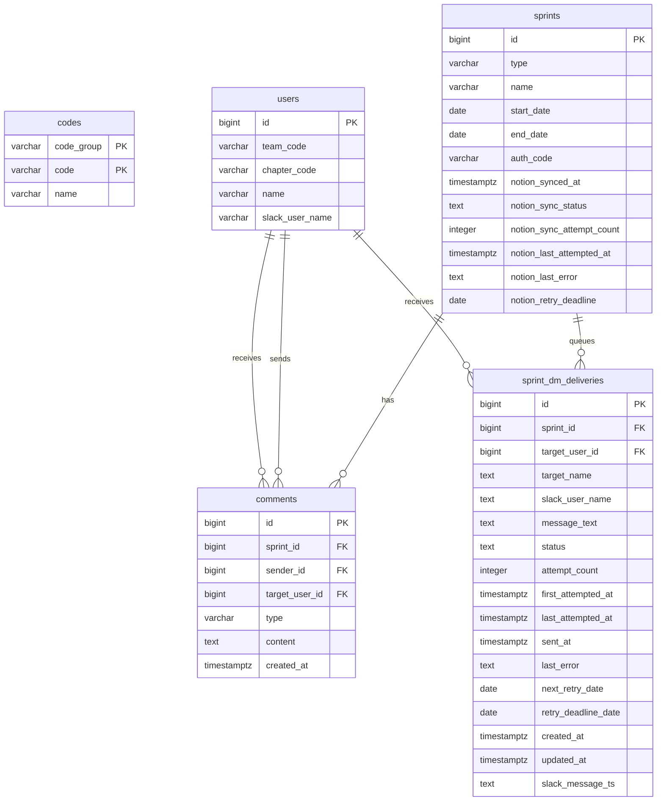

# 2. Database

## 개요

데이터베이스는 Supabase Postgres를 사용하며, 프론트엔드는 공개 키로 RPC를 호출하고, 운영 자동화는 Edge Function에서 서비스 롤 권한으로 RPC를 호출한다.

현재 코드 기준 핵심 역할은 다음과 같다.

- `sprints`: 설문 작성 가능 기간과 운영 상태 관리
- `users`: 작성자 및 피드백 수신자 식별
- `comments`: Stop, Start, Continue, MVP 원본 저장
- `codes`: 팀/챕터 선택지 관리
- `sprint_dm_deliveries`: Slack DM 발송 큐 및 재시도 상태 관리

## Table

### `codes`

팀과 챕터 선택지의 마스터 코드 테이블이다.

| Column | Type | Nullable | Description |
|---|---|---|---|
| `code_group` | `varchar` | No | `team` 또는 `chapter` |
| `code` | `varchar` | No | 코드 값 |
| `name` | `varchar` | No | 화면에 노출되는 이름 |

제약 조건

- PK: `(``code_group``, ``code``)`
- CHECK: `code_group in ('team', 'chapter')`

### `users`

설문 작성자와 피드백 수신자를 모두 표현하는 멤버 테이블이다.

| Column | Type | Nullable | Description |
|---|---|---|---|
| `id` | `bigint` | No | 사용자 PK |
| `team_code` | `varchar` | No | 소속 팀 코드 |
| `chapter_code` | `varchar` | No | 소속 챕터 코드 |
| `name` | `varchar` | No | 사용자 이름 |
| `slack_user_name` | `varchar` | Yes | Slack Member ID |

제약 조건

- PK: `id`

참고

- `team_code`, `chapter_code`는 논리적으로 `codes`와 연결된다.
- 현재 제공된 스키마에는 FK가 없으므로 애플리케이션/RPC 수준 검증이 중요하다.

### `sprints`

스프린트 메타데이터와 Notion 동기화 상태를 관리한다.

| Column | Type | Nullable | Description |
|---|---|---|---|
| `id` | `bigint` | No | 스프린트 PK |
| `type` | `varchar` | No | `team` 또는 `chapter` |
| `name` | `varchar` | No | 스프린트 이름 |
| `start_date` | `date` | No | 시작일 |
| `end_date` | `date` | No | 종료일 |
| `auth_code` | `varchar` | No | 설문 진입용 인증 코드 |
| `notion_synced_at` | `timestamptz` | Yes | Notion 동기화 완료 시각 |
| `notion_sync_status` | `text` | No | 동기화 상태 |
| `notion_sync_attempt_count` | `integer` | No | 재시도 횟수 |
| `notion_last_attempted_at` | `timestamptz` | Yes | 최근 시도 시각 |
| `notion_last_error` | `text` | Yes | 최근 실패 사유 |
| `notion_retry_deadline` | `date` | Yes | 재시도 종료일 |

제약 조건

- PK: `id`
- UNIQUE: `auth_code`
- CHECK: `type in ('team', 'chapter')`

### `comments`

Stop, Start, Continue, MVP 피드백 원본을 모두 저장한다.

| Column | Type | Nullable | Description |
|---|---|---|---|
| `id` | `bigint` | No | 코멘트 PK |
| `sprint_id` | `bigint` | No | 대상 스프린트 |
| `sender_id` | `bigint` | No | 작성자 사용자 ID |
| `target_user_id` | `bigint` | No | 수신자 사용자 ID |
| `type` | `varchar` | No | `start`, `stop`, `continue`, `mvp` |
| `content` | `text` | No | 코멘트 본문 |
| `created_at` | `timestamptz` | Yes | 생성 시각 |

제약 조건

- PK: `id`
- FK: `sprint_id -> sprints.id`
- FK: `sender_id -> users.id`
- FK: `target_user_id -> users.id`
- CHECK: `type in ('start', 'stop', 'continue', 'mvp')`

설계 메모

- MVP도 별도 테이블이 아니라 `comments.type = 'mvp'`로 저장한다.
- 하나의 입력 행이 여러 수신자에게 전달될 경우, 최종 저장 시에는 수신자별 row로 펼쳐진다.

### `sprint_dm_deliveries`

Slack DM 발송 큐와 재시도 상태를 관리한다.

| Column | Type | Nullable | Description |
|---|---|---|---|
| `id` | `bigint` | No | delivery PK |
| `sprint_id` | `bigint` | No | 대상 스프린트 |
| `target_user_id` | `bigint` | No | 수신자 사용자 ID |
| `target_name` | `text` | No | 수신자 이름 스냅샷 |
| `slack_user_name` | `text` | Yes | Slack Member ID |
| `message_text` | `text` | No | 발송 메시지 payload |
| `status` | `text` | No | `pending` 등 delivery 상태 |
| `attempt_count` | `integer` | No | 시도 횟수 |
| `first_attempted_at` | `timestamptz` | Yes | 최초 시도 시각 |
| `last_attempted_at` | `timestamptz` | Yes | 최근 시도 시각 |
| `sent_at` | `timestamptz` | Yes | 발송 완료 시각 |
| `last_error` | `text` | Yes | 최근 실패 원인 |
| `next_retry_date` | `date` | No | 다음 재시도 예정일 |
| `retry_deadline_date` | `date` | No | 재시도 종료일 |
| `created_at` | `timestamptz` | No | 생성 시각 |
| `updated_at` | `timestamptz` | No | 수정 시각 |
| `slack_message_ts` | `text` | Yes | Slack 메시지 TS |

제약 조건

- PK: `id`
- FK: `sprint_id -> sprints.id`
- FK: `target_user_id -> users.id`

설계 메모

- DM 생성과 실제 발송을 분리해 재시도 가능한 비동기 큐처럼 사용한다.
- `message_text`는 Slack block payload를 문자열로 저장한다.

## ERD



보조 관계

- `users.team_code -> codes(code)` where `code_group = 'team'`
- `users.chapter_code -> codes(code)` where `code_group = 'chapter'`

이 두 관계는 현재 FK가 아니라 논리 관계다.

## RLS

현재 저장소에는 개별 정책 SQL 전체가 포함되어 있지는 않지만, 함수 정의와 운영 구조상 접근 전략은 명확하다.

- 프론트엔드는 `VITE_SUPABASE_PUBLISHABLE_KEY`로 Supabase에 접근한다.
- 프론트엔드의 DB 접근은 테이블 직접 조회가 아니라 RPC 중심이다.
- Edge Function은 `SUPABASE_SERVICE_ROLE_KEY`로 운영 작업을 수행한다.
- `rls_auto_enable()` 이벤트 트리거 함수가 있어 `public` 스키마의 신규 테이블 생성 시 자동으로 RLS를 활성화하도록 설계되어 있다.

### 접근 원칙

- 클라이언트는 직접 테이블에 접근하지 않고 RPC를 통해 제한된 데이터만 조회/수정한다.
- 민감하거나 원본 데이터가 포함된 조회는 `SECURITY DEFINER` 함수로 감싼다.
- 배치 자동화는 서비스 롤 권한이 필요한 작업이므로 클라이언트 영역과 분리되어 있다.

### 클라이언트 노출 RPC

아래 RPC는 클라이언트 또는 제한된 공개 접근 경로에서 사용되며, 모두 `SECURITY DEFINER`로 정의되어 있다.

| function | security_definer | 역할 |
|---|---|---|
| `get_comments_for_sprint` | `true` | 스프린트 코멘트 조회 |
| `get_users_by_sprint` | `true` | 현재 스프린트 기준 피드백 대상자 조회 |
| `submit_comments` | `true` | 설문 전체 제출 처리 |
| `search_users_by_name_prefix` | `true` | 이름 prefix 기반 사용자 검색 |

### 현재 확인 가능한 상태

- 테이블별 RLS `ENABLE` 여부
- 클라이언트는 RPC만 사용하고 직접 테이블 CRUD를 수행하지 않는다.
- 주요 클라이언트용 쓰기/읽기 RPC는 `SECURITY DEFINER`로 감싸져 있다.
- 운영 자동화용 함수는 Edge Function 내부 서비스 롤 호출을 전제로 한다.

### 추가 확인 필요

- 각 테이블에 적용된 세부 `POLICY`
- `anon` 역할에 허용된 RPC 목록 전체
- 운영용 RPC 중 `SECURITY DEFINER`가 생략된 함수들의 호출 주체와 권한 전제
- 테이블 직접 `select/insert/update` 허용 여부

| 대상 | 주체 | 허용 작업 | 비고 |
|---|---|---|---|
| `comments` | `anon` | 직접 접근 없음 | `submit_comments` RPC만 사용 |
| `sprints` | `anon` | 직접 접근 없음 | `has_active_sprint`, `get_sprint_info_by_code` RPC 사용 |
| `users` | `anon` | 직접 접근 없음 | `is_valid_user`, `get_users_by_sprint` RPC 사용 |

## RPC

RPC는 크게 프론트엔드 실시간 입력 플로우와 운영 자동화 배치 플로우로 나뉜다.

### 프론트엔드용 RPC 개요

| RPC | 목적 |
|---|---|
| `has_active_sprint` | 현재 작성 가능한 활성 스프린트 존재 여부 확인 |
| `get_sprint_info_by_code` | 인증 코드 기반 스프린트 검증 |
| `get_chapter_codes` | 챕터 코드 목록 조회 |
| `get_team_codes` | 팀 코드 목록 조회 |
| `is_valid_user` | 작성자 유효성 검증 |
| `get_users_by_sprint` | 대상 멤버 목록 조회 |
| `submit_comments` | 설문 최종 제출 |

### 프론트엔드용 RPC 상세

#### `has_active_sprint()`

- 목적: 현재 날짜 기준으로 작성 가능한 스프린트가 하나라도 있는지 확인한다.
- 반환: `boolean`
- 동작:
  - `sprints` 테이블에서 `current_date between start_date and end_date` 조건을 만족하는 row 존재 여부를 반환한다.

```sql
CREATE OR REPLACE FUNCTION public.has_active_sprint()
 RETURNS boolean
 LANGUAGE plpgsql
 SECURITY DEFINER
AS $function$
declare
    v_exists boolean;
begin
    select exists (
        select 1
        from sprints
        where current_date between start_date and end_date
    )
    into v_exists;

    return v_exists;
end;
$function$
```

#### `get_sprint_info_by_code(p_auth_code text)`

- 목적: 사용자가 입력한 인증 코드가 현재 작성 가능한 스프린트인지 검증한다.
- 반환: `sprint_check_result`
  - `is_valid`
  - `type`
  - `name`
- 동작:
  - `auth_code`가 일치하고 현재 날짜가 작성 기간 안에 있는 `sprints`를 조회한다.
  - 없으면 `(false, null)` 형태 결과를 반환한다.

```sql
CREATE OR REPLACE FUNCTION public.get_sprint_info_by_code(p_auth_code text)
 RETURNS sprint_check_result
 LANGUAGE plpgsql
 SECURITY DEFINER
AS $function$
declare
    v_result sprint_check_result;
begin
    select
        true,
        type,
        name
    into v_result
    from sprints
    where auth_code = p_auth_code
      and current_date between start_date and end_date
    limit 1;

    if v_result is null then
        v_result := (false, null);
    end if;

    return v_result;
end;
$function$
```

#### `get_chapter_codes()`

- 목적: 챕터 선택지 목록을 제공한다.
- 반환: `table(code, name)`
- 동작:
  - `codes`에서 `code_group = 'chapter'`만 조회해 `code` 순으로 정렬한다.

```sql
CREATE OR REPLACE FUNCTION public.get_chapter_codes()
 RETURNS TABLE(code character varying, name character varying)
 LANGUAGE plpgsql
 SECURITY DEFINER
AS $function$
begin
    return query
    select c.code, c.name
    from codes c
    where c.code_group = 'chapter'
    order by c.code;
end;
$function$
```

#### `get_team_codes()`

- 목적: 팀 선택지 목록을 제공한다.
- 반환: `table(code, name)`
- 동작:
  - `codes`에서 `code_group = 'team'`만 조회해 `code` 순으로 정렬한다.

```sql
CREATE OR REPLACE FUNCTION public.get_team_codes()
 RETURNS TABLE(code character varying, name character varying)
 LANGUAGE plpgsql
 SECURITY DEFINER
AS $function$
begin
    return query
    select c.code, c.name
    from codes c
    where c.code_group = 'team'
    order by c.code;
end;
$function$
```

#### `is_valid_user(p_name text, p_team_code text, p_chapter_code text)`

- 목적: 설문 작성자가 실제 등록된 사용자 조합인지 검증한다.
- 반환: `boolean`
- 동작:
  - `users` 테이블에서 `name`, `team_code`, `chapter_code`가 모두 일치하는 row 존재 여부를 반환한다.

```sql
CREATE OR REPLACE FUNCTION public.is_valid_user(p_name text, p_team_code text, p_chapter_code text)
 RETURNS boolean
 LANGUAGE plpgsql
 SECURITY DEFINER
AS $function$
declare
    v_exists boolean;
begin
    select exists (
        select 1
        from users
        where name = p_name
          and team_code = p_team_code
          and chapter_code = p_chapter_code
    )
    into v_exists;

    return v_exists;
end;
$function$
```

#### `get_users_by_sprint(p_auth_code text, p_name text, p_team_code text, p_chapter_code text)`

- 목적: 현재 작성자가 피드백을 보낼 수 있는 동료 목록을 조회한다.
- 반환: `table(id, name)`
- 동작:
  - `auth_code`로 스프린트를 찾고 현재 작성 기간인지 확인한다.
  - 스프린트 타입이 `team`이면 같은 `team_code`, `chapter`면 같은 `chapter_code` 사용자를 조회한다.
  - 작성자 본인 이름은 제외한다.

```sql
CREATE OR REPLACE FUNCTION public.get_users_by_sprint(
  p_auth_code text,
  p_name text,
  p_team_code text,
  p_chapter_code text
)
 RETURNS TABLE(id bigint, name text)
 LANGUAGE sql
 SECURITY DEFINER
AS $function$
    select u.id, u.name
    from users u
    join sprints s on s.auth_code = p_auth_code
    where current_date between s.start_date and s.end_date
      and (
        (s.type = 'team' and u.team_code = p_team_code)
        or
        (s.type = 'chapter' and u.chapter_code = p_chapter_code)
      )
      and u.name <> p_name;
$function$
```

#### `search_users_by_name_prefix(p_name text)`

- 목적: 이름 prefix 기반 사용자 검색을 수행한다.
- 반환: `SETOF users`
- 동작:
  - `users.name ilike p_name || '%'` 조건으로 조회하고 이름순 정렬한다.
- 참고:
  - 현재 프론트 코드에서는 직접 사용 흔적이 보이지 않지만, 관리 기능이나 향후 검색 UX에 활용할 수 있다.

```sql
CREATE OR REPLACE FUNCTION public.search_users_by_name_prefix(p_name text)
 RETURNS SETOF users
 LANGUAGE sql
 SECURITY DEFINER
AS $function$
    select *
    from users
    where name ilike p_name || '%'
    order by name;
$function$
```

#### `submit_comments(p_payload jsonb)`

- 목적: 설문 전체 제출 payload를 검증하고 `comments`에 저장한다.
- 반환: `api_write_result`
  - `success`
  - `code`
  - `message`
- 처리 순서:
  1. `user_name`, `user_team`, `user_chapter` 조합으로 작성자 `users.id`를 찾는다.
  2. `p_sprint_auth_code`로 현재 유효한 `sprints.id`를 찾는다.
  3. `stop_comments` 배열을 순회하며 `comments`에 `type = 'stop'`으로 insert 한다.
  4. `start_comments` 배열을 순회하며 `type = 'start'`로 insert 한다.
  5. `continue_comments` 배열을 순회하며 `type = 'continue'`로 insert 한다.
  6. `mvp`가 있으면 `type = 'mvp'`로 insert 한다.
  7. 성공 시 `SUCCESS`, 실패 시 예외를 잡아 `UNKNOWN_ERROR`를 반환한다.
- 특징:
  - 프론트는 한 번의 RPC 호출만 수행하고, DB 내부에서 여러 row insert가 일괄 처리된다.
  - 작성자 미존재와 유효하지 않은 스프린트를 명시적 에러 코드로 구분한다.

```sql
CREATE OR REPLACE FUNCTION public.submit_comments(p_payload jsonb)
 RETURNS api_write_result
 LANGUAGE plpgsql
 SECURITY DEFINER
AS $function$
declare
    v_sender_id bigint;
    v_sprint_id bigint;
    v_item jsonb;
begin
    select id into v_sender_id
    from users
    where name = p_payload->>'user_name'
      and team_code = p_payload->>'user_team'
      and chapter_code = p_payload->>'user_chapter'
    limit 1;

    if v_sender_id is null then
        return (false, 'USER_NOT_FOUND'::text, '사용자를 찾을 수 없습니다'::text);
    end if;

    select id into v_sprint_id
    from sprints
    where auth_code = p_payload->>'p_sprint_auth_code'
      and current_date between start_date and end_date
    limit 1;

    if v_sprint_id is null then
        return (false, 'INVALID_SPRINT'::text, '유효하지 않은 스프린트입니다'::text);
    end if;

    if p_payload ? 'stop_comments' and p_payload->'stop_comments' is not null then
        for v_item in
            select * from jsonb_array_elements(p_payload->'stop_comments')
        loop
            insert into comments (sprint_id, sender_id, target_user_id, type, content)
            values (
                v_sprint_id,
                v_sender_id,
                (v_item->>'target_user_id')::bigint,
                'stop',
                v_item->>'comment_text'
            );
        end loop;
    end if;

    if p_payload ? 'start_comments' and p_payload->'start_comments' is not null then
        for v_item in
            select * from jsonb_array_elements(p_payload->'start_comments')
        loop
            insert into comments (sprint_id, sender_id, target_user_id, type, content)
            values (
                v_sprint_id,
                v_sender_id,
                (v_item->>'target_user_id')::bigint,
                'start',
                v_item->>'comment_text'
            );
        end loop;
    end if;

    if p_payload ? 'continue_comments' and p_payload->'continue_comments' is not null then
        for v_item in
            select * from jsonb_array_elements(p_payload->'continue_comments')
        loop
            insert into comments (sprint_id, sender_id, target_user_id, type, content)
            values (
                v_sprint_id,
                v_sender_id,
                (v_item->>'target_user_id')::bigint,
                'continue',
                v_item->>'comment_text'
            );
        end loop;
    end if;

    if p_payload ? 'mvp' and p_payload->'mvp' is not null then
        insert into comments (sprint_id, sender_id, target_user_id, type, content)
        values (
            v_sprint_id,
            v_sender_id,
            (p_payload->'mvp'->>'target_user_id')::bigint,
            'mvp',
            p_payload->'mvp'->>'comment_text'
        );
    end if;

    return (true, 'SUCCESS'::text, '피드백 제출 완료'::text);

exception
    when others then
        return (false, 'UNKNOWN_ERROR'::text, SQLERRM::text);
end;
$function$
```

### 운영 자동화용 RPC 개요

| RPC | 목적 |
|---|---|
| `get_sprints_for_notion_delivery` | Notion 동기화 대상 조회 |
| `get_comments_for_sprint` | 특정 스프린트 코멘트 조회 |
| `mark_sprint_notion_synced` | 동기화 성공 처리 |
| `mark_sprint_notion_failed` | 동기화 실패 처리 |
| `recover_stale_processing_deliveries` | 비정상 상태 delivery 복구 |
| `expire_sprint_dm_deliveries` | 재시도 기한 초과 delivery 만료 처리 |
| `get_sprints_for_dm_enqueue` | DM 생성 대상 스프린트 조회 |
| `get_sprint_comment_rows` | DM 메시지 구성용 코멘트 row 조회 |
| `enqueue_sprint_dm_delivery` | delivery row 생성 |
| `get_due_sprint_dm_deliveries` | 발송 시점이 된 delivery 조회 |
| `mark_sprint_dm_sent` | 발송 성공 처리 |
| `mark_sprint_dm_failed` | 발송 실패 처리 및 재시도 일정 갱신 |

### 운영 자동화용 RPC 상세

#### Notion 동기화 관련

##### `get_sprints_for_notion_delivery(p_run_date date)`

- 목적: Notion 동기화가 필요한 스프린트를 조회한다.
- 반환: `table(id, name)`
- 동작:
  - 종료일이 실행일 전날 이전인 스프린트 중
  - `notion_sync_status in ('pending', 'failed')`
  - `notion_sync_attempt_count < 3`
  - `p_run_date <= notion_retry_deadline`
  - 같은 날짜에 이미 시도하지 않은 건만 반환한다.

```sql
CREATE OR REPLACE FUNCTION public.get_sprints_for_notion_delivery(p_run_date date)
 RETURNS TABLE(id bigint, name text)
 LANGUAGE sql
AS $function$
  SELECT id, name
  FROM sprints
  WHERE end_date <= p_run_date - interval '1 day'
    AND notion_sync_status IN ('pending', 'failed')
    AND notion_sync_attempt_count < 3
    AND p_run_date <= notion_retry_deadline
    AND (
      notion_last_attempted_at IS NULL
      OR timezone('Asia/Seoul', notion_last_attempted_at)::date < p_run_date
    );
$function$
```

##### `get_comments_for_sprint(p_sprint_id integer)`

- 목적: Notion 적재용 코멘트 원본을 가져온다.
- 반환: `table(type, content, sender_id, sender_name, target_name)`
- 동작:
  - `comments`, `users`를 조인해 발신자와 수신자 이름까지 함께 반환한다.
- 특징:
  - Notion 동기화 시 발신자/본문 기준 그룹핑을 위해 필요한 최소 정보만 노출한다.

```sql
CREATE OR REPLACE FUNCTION public.get_comments_for_sprint(p_sprint_id integer)
 RETURNS TABLE(type text, content text, sender_id integer, sender_name text, target_name text)
 LANGUAGE sql
 SECURITY DEFINER
AS $function$
    select
      c.type::text,
      c.content,
      s.id as sender_id,
      s.name::text as sender_name,
      t.name::text as target_name
    from comments c
    join users s on s.id = c.sender_id
    join users t on t.id = c.target_user_id
    where c.sprint_id = p_sprint_id;
$function$
```

##### `mark_sprint_notion_synced(p_sprint_id bigint)`

- 목적: Notion 동기화 성공 상태를 기록한다.
- 동작:
  - `notion_sync_status = 'synced'`
  - `notion_synced_at = now()`
  - `notion_last_error = NULL`
  - `notion_sync_attempt_count += 1`
  - `notion_last_attempted_at = now()`

```sql
CREATE OR REPLACE FUNCTION public.mark_sprint_notion_synced(p_sprint_id bigint)
 RETURNS void
 LANGUAGE sql
AS $function$
  UPDATE sprints
  SET
    notion_sync_status        = 'synced',
    notion_synced_at          = now(),
    notion_last_error         = NULL,
    notion_sync_attempt_count = notion_sync_attempt_count + 1,
    notion_last_attempted_at  = now()
  WHERE id = p_sprint_id;
$function$
```

##### `mark_sprint_notion_failed(p_sprint_id bigint, p_error text, p_run_date date)`

- 목적: Notion 동기화 실패와 재시도 상태를 기록한다.
- 동작:
  - 시도 횟수를 증가시킨다.
  - 3회 이상 시도했거나 재시도 마감일을 넘기면 `expired`, 아니면 `failed`로 전환한다.
  - 마지막 시도 시각과 에러 메시지를 저장한다.

```sql
CREATE OR REPLACE FUNCTION public.mark_sprint_notion_failed(
  p_sprint_id bigint,
  p_error text,
  p_run_date date
)
 RETURNS void
 LANGUAGE plpgsql
AS $function$
DECLARE
  v_new_count  integer;
  v_deadline   date;
  v_new_status text;
BEGIN
  SELECT notion_sync_attempt_count + 1, notion_retry_deadline
  INTO   v_new_count, v_deadline
  FROM   sprints
  WHERE  id = p_sprint_id;

  IF v_new_count >= 3 OR p_run_date > v_deadline THEN
    v_new_status := 'expired';
  ELSE
    v_new_status := 'failed';
  END IF;

  UPDATE sprints
  SET
    notion_sync_status        = v_new_status,
    notion_sync_attempt_count = v_new_count,
    notion_last_attempted_at  = now(),
    notion_last_error         = p_error
  WHERE id = p_sprint_id;
END;
$function$
```

#### Slack DM 큐 생성/조회 관련

##### `get_sprints_for_dm_enqueue(p_run_date date)`

- 목적: DM 큐를 생성해야 하는 스프린트를 조회한다.
- 반환: `table(id, name, retry_deadline_date)`
- 동작:
  - `end_date = p_run_date - 1 day` 인 스프린트를 조회한다.
  - 재시도 마감일은 `end_date + 3 days`로 계산한다.

```sql
CREATE OR REPLACE FUNCTION public.get_sprints_for_dm_enqueue(p_run_date date)
 RETURNS TABLE(id bigint, name text, retry_deadline_date date)
 LANGUAGE sql
AS $function$
  SELECT
    id,
    name,
    (end_date + interval '3 days')::date AS retry_deadline_date
  FROM sprints
  WHERE end_date = p_run_date - interval '1 day';
$function$
```

##### `get_sprint_comment_rows(p_sprint_id bigint)`

- 목적: 유저별 DM 메시지 구성을 위한 코멘트 row를 조회한다.
- 반환: `table(target_user_id, slack_user_name, target_name, type, content)`
- 동작:
  - `comments`와 `users`를 조인해 수신자 단위 메시지 구성에 필요한 값을 모두 반환한다.

```sql
CREATE OR REPLACE FUNCTION public.get_sprint_comment_rows(p_sprint_id bigint)
 RETURNS TABLE(target_user_id bigint, slack_user_name text, target_name text, type text, content text)
 LANGUAGE sql
AS $function$
  SELECT
    u.id              AS target_user_id,
    u.slack_user_name,
    u.name            AS target_name,
    c.type,
    c.content
  FROM comments c
  JOIN users    u ON u.id = c.target_user_id
  WHERE c.sprint_id = p_sprint_id;
$function$
```

##### `enqueue_sprint_dm_delivery(...)`

- 목적: 수신자별 DM 발송 큐 row를 생성한다.
- 동작:
  - `sprint_dm_deliveries`에 insert 한다.
  - `(sprint_id, target_user_id)` 충돌 시 `DO NOTHING` 처리한다.
- 특징:
  - 같은 스프린트와 같은 수신자 조합에 대해 중복 큐 적재를 방지한다.

```sql
CREATE OR REPLACE FUNCTION public.enqueue_sprint_dm_delivery(
  p_sprint_id bigint,
  p_target_user_id bigint,
  p_target_name text,
  p_slack_user_name text,
  p_message_text text,
  p_next_retry_date date,
  p_retry_deadline_date date
)
 RETURNS void
 LANGUAGE sql
AS $function$
  INSERT INTO sprint_dm_deliveries (
    sprint_id,
    target_user_id,
    target_name,
    slack_user_name,
    message_text,
    next_retry_date,
    retry_deadline_date
  ) VALUES (
    p_sprint_id,
    p_target_user_id,
    p_target_name,
    p_slack_user_name,
    p_message_text,
    p_next_retry_date,
    p_retry_deadline_date
  )
  ON CONFLICT (sprint_id, target_user_id) DO NOTHING;
$function$
```

##### `get_due_sprint_dm_deliveries(p_run_date date)`

- 목적: 현재 발송해야 할 delivery를 잠그고 가져온다.
- 반환: `table(id, sprint_id, target_user_id, target_name, slack_user_name, message_text)`
- 동작:
  - `status in ('pending', 'failed')`
  - `sent_at is null`
  - `next_retry_date <= p_run_date`
  - `p_run_date <= retry_deadline_date`
  - `attempt_count < 3`
  - 조건을 만족하는 row를 `FOR UPDATE SKIP LOCKED`로 잡은 뒤 `status = 'processing'`으로 변경하면서 반환한다.
- 특징:
  - 동시에 여러 워커가 돌아도 중복 발송 가능성을 낮춘다.

```sql
CREATE OR REPLACE FUNCTION public.get_due_sprint_dm_deliveries(p_run_date date)
 RETURNS TABLE(id bigint, sprint_id bigint, target_user_id bigint, target_name text, slack_user_name text, message_text text)
 LANGUAGE plpgsql
AS $function$
BEGIN
  RETURN QUERY
  UPDATE sprint_dm_deliveries
  SET
    status     = 'processing',
    updated_at = now()
  WHERE sprint_dm_deliveries.id IN (
    SELECT d.id
    FROM   sprint_dm_deliveries d
    WHERE  d.status IN ('pending', 'failed')
      AND  d.sent_at IS NULL
      AND  d.next_retry_date <= p_run_date
      AND  p_run_date <= d.retry_deadline_date
      AND  d.attempt_count < 3
    FOR UPDATE SKIP LOCKED
  )
  RETURNING
    sprint_dm_deliveries.id,
    sprint_dm_deliveries.sprint_id,
    sprint_dm_deliveries.target_user_id,
    sprint_dm_deliveries.target_name,
    sprint_dm_deliveries.slack_user_name,
    sprint_dm_deliveries.message_text;
END;
$function$
```

##### `recover_stale_processing_deliveries()`

- 목적: 오래된 `processing` 상태를 복구한다.
- 반환: `integer`
- 동작:
  - `slack_message_ts`가 있으면 실제 발송 후 DB 갱신만 실패한 것으로 보고 `sent`로 복구한다.
  - `slack_message_ts`가 없으면 발송 불확실 상태로 보고 `failed`로 되돌린다.

```sql
CREATE OR REPLACE FUNCTION public.recover_stale_processing_deliveries()
 RETURNS integer
 LANGUAGE plpgsql
AS $function$
DECLARE
  v_count integer;
BEGIN
  UPDATE sprint_dm_deliveries
  SET
    status   = 'sent',
    sent_at  = COALESCE(sent_at, now()),
    updated_at = now()
  WHERE status = 'processing'
    AND updated_at < now() - interval '1 hour'
    AND slack_message_ts IS NOT NULL;

  UPDATE sprint_dm_deliveries
  SET
    status     = 'failed',
    updated_at = now()
  WHERE status = 'processing'
    AND updated_at < now() - interval '1 hour'
    AND slack_message_ts IS NULL;

  GET DIAGNOSTICS v_count = ROW_COUNT;
  RETURN v_count;
END;
$function$
```

##### `expire_sprint_dm_deliveries(p_run_date date)`

- 목적: 재시도 기한이 지난 delivery를 만료 처리한다.
- 반환: `integer`
- 동작:
  - `status in ('pending', 'failed')` 이고 `retry_deadline_date < p_run_date` 인 row를 `expired`로 바꾼다.

```sql
CREATE OR REPLACE FUNCTION public.expire_sprint_dm_deliveries(p_run_date date)
 RETURNS integer
 LANGUAGE plpgsql
AS $function$
DECLARE
  v_count integer;
BEGIN
  UPDATE sprint_dm_deliveries
  SET
    status     = 'expired',
    updated_at = now()
  WHERE status IN ('pending', 'failed')
    AND retry_deadline_date < p_run_date;

  GET DIAGNOSTICS v_count = ROW_COUNT;
  RETURN v_count;
END;
$function$
```

##### `mark_sprint_dm_sent(p_delivery_id bigint, p_slack_message_ts text)`

- 목적: Slack DM 발송 성공 상태를 기록한다.
- 동작:
  - `status = 'sent'`
  - `sent_at = now()`
  - `last_error = NULL`
  - `slack_message_ts` 저장
  - 시도 횟수와 시도 시각 갱신

```sql
CREATE OR REPLACE FUNCTION public.mark_sprint_dm_sent(p_delivery_id bigint, p_slack_message_ts text)
 RETURNS void
 LANGUAGE sql
AS $function$
  UPDATE sprint_dm_deliveries
  SET
    status             = 'sent',
    sent_at            = now(),
    last_error         = NULL,
    slack_message_ts   = p_slack_message_ts,
    attempt_count      = attempt_count + 1,
    first_attempted_at = COALESCE(first_attempted_at, now()),
    last_attempted_at  = now(),
    updated_at         = now()
  WHERE id = p_delivery_id;
$function$
```

##### `mark_sprint_dm_failed(p_delivery_id bigint, p_error text, p_next_retry_date date)`

- 목적: Slack DM 발송 실패와 재시도 정보를 기록한다.
- 동작:
  - 시도 횟수를 증가시킨다.
  - 다음 재시도일이 마감일을 넘기거나 3회 이상이면 `expired`, 아니면 `failed`로 저장한다.
  - 마지막 에러, 시도 시각, 다음 재시도일을 함께 기록한다.

```sql
CREATE OR REPLACE FUNCTION public.mark_sprint_dm_failed(
  p_delivery_id bigint,
  p_error text,
  p_next_retry_date date
)
 RETURNS void
 LANGUAGE plpgsql
AS $function$
DECLARE
  v_new_count  integer;
  v_deadline   date;
  v_new_status text;
BEGIN
  SELECT attempt_count + 1, retry_deadline_date
  INTO   v_new_count, v_deadline
  FROM   sprint_dm_deliveries
  WHERE  id = p_delivery_id;

  IF v_new_count >= 3 OR p_next_retry_date > v_deadline THEN
    v_new_status := 'expired';
  ELSE
    v_new_status := 'failed';
  END IF;

  UPDATE sprint_dm_deliveries
  SET
    status             = v_new_status,
    attempt_count      = v_new_count,
    first_attempted_at = COALESCE(first_attempted_at, now()),
    last_attempted_at  = now(),
    last_error         = p_error,
    next_retry_date    = p_next_retry_date,
    updated_at         = now()
  WHERE id = p_delivery_id;
END;
$function$
```

## 데이터 흐름 관점 요약

### 설문 제출

1. 스프린트 코드 검증
2. 작성자 검증
3. 대상 멤버 조회
4. `submit_comments` RPC로 `comments` 저장

### Notion 동기화

1. 대상 스프린트 조회
2. `comments` 집계
3. Notion API 저장
4. `sprints` 동기화 상태 갱신

### Slack DM

1. 대상 스프린트 조회
2. `comments` 기반으로 유저별 메시지 생성
3. `sprint_dm_deliveries` enqueue
4. 발송 시도
5. 상태 및 재시도 정보 갱신
